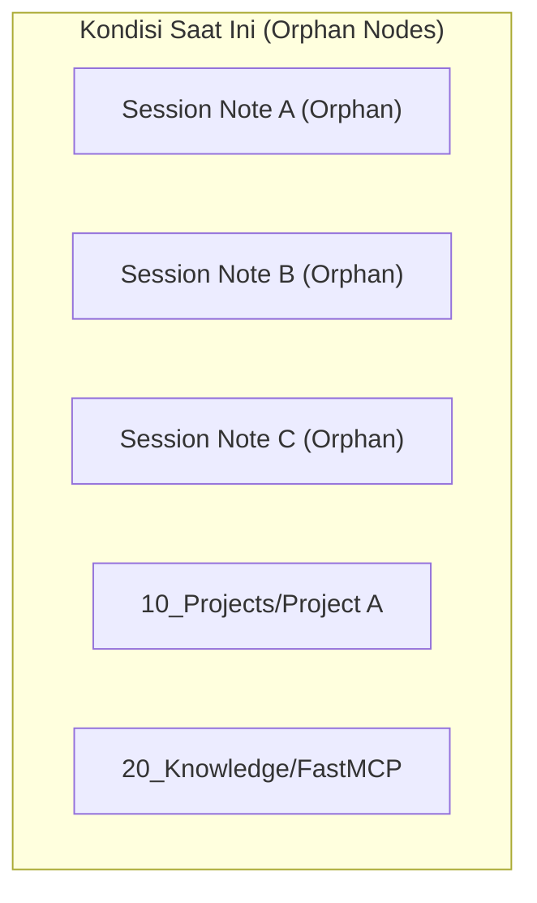
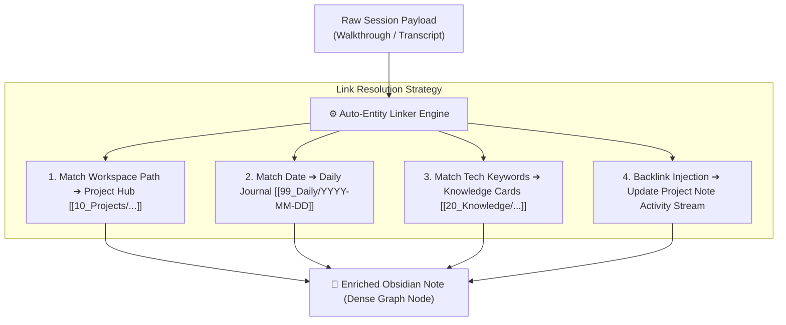
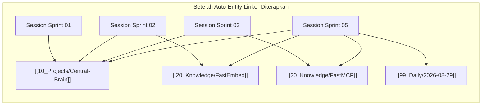

# 26. Otomatisasi Koneksi Graph, Wikilinks, dan Solusi Orphan Nodes di Obsidian

| Metadata | Nilai |
| :--- | :--- |
| **Topik** | Mengapa Node Ingest Terpisah (Orphan Nodes) & Solusi Auto-Linking Graph |
| **Status** | 💡 Brainstorming & Architectural Design |
| **Terkait** | [07-taksonomi-vault-dan-standar-metadata.md](./07-taksonomi-vault-dan-standar-metadata.md), [13-korelasi-projek-fxmedia-dan-hybrid-graph-rag.md](./13-korelasi-projek-fxmedia-dan-hybrid-graph-rag.md), [24-lokasi-storage-harvester-dan-katalog-data-ingesti.md](./24-lokasi-storage-harvester-dan-katalog-data-ingesti.md) |
| **Tanggal** | 2026-08-29 |

---

## 1. Masalah: Mengapa Hasil Ingest Menjadi Node Terpisah (*Orphan Nodes*)?

Saat melihat **Graph View** di Obsidian setelah menjalankan `devbrain ingest`, catatan sesi yang baru diserap sering kali terlihat sebagai titik-titik pulau yang terisolasi (*orphan nodes*) tanpa garis penghubung (*edges*).



### Mengapa hal ini terjadi secara teknis?
1. **Sifat Alami Obsidian Graph View:**
   * Obsidian Graph View **hanya menggambar garis penghubung (*edge*)** jika terdapat sintaks `[[Nama Catatan]]` (*Wikilinks*) atau *Markdown links* langsung di dalam isi teks atau frontmatter catatan.
   * `tags` (seperti `#agent-inbox`) hanya mengelompokkan warna/grup di filter graph, bukan membentuk garis relasi struktural.
2. **Fase Ingestion Mentah (*Raw Ingestion Phase*):**
   * Sesi IDE diekstrak dari disk lokal berdasarkan ID sesi (`brain/<uuid>/walkthrough.md`). Pada tahap ekstraksi mentah, note tersebut belum mengetahui apakah di vault sudah ada note project `[[10_Projects/MyApp/README|MyApp]]` atau note teknologi `[[20_Knowledge/Python|Python]]`.

---

## 2. Solusi: Arsitektur *Auto-Entity Linker & Graph Connector Engine*

Untuk mengubah node terisolasi menjadi jaring laba-laba pengetahuan yang terhubung rapat (*Dense Knowledge Graph*), `devbrain` membutuhkan subsistem **Auto-Entity Linker** yang dijalankan tepat setelah ekstraksi note atau sebagai background post-processor.



---

## 3. Tiga Pilar Strategi Koneksi Otomatis (*Auto-Linking Strategy*)

### Pilar 1: *Project Workspace Path Mapping* (Koneksi ke Hub Projek)
* Saat sesi IDE diekstrak, `devbrain` mengekstrak metadata `workspace_path` (misal: `E:/_PROJECT/_Central AI Brain Hub`).
* Sistem mencocokkan `workspace_path` dengan katalog projek di `10_Projects/`.
* **Output yang diinjeksi ke note sesi:**
  ```markdown
  ## 🔗 Relasi & Konteks Graph:
  - **Project Hub:** [[10_Projects/_Central AI Brain Hub/README|_Central AI Brain Hub]]
  - **Device Origin:** `omen-15`
  ```

### Pilar 2: *Chronological & Daily Linking* (Koneksi ke Jurnal Harian)
* Sesi memiliki timestamp `created: 2026-08-29T07:44:52`.
* Sistem otomatis menghubungkan sesi ke catatan harian pada tanggal tersebut:
  ```markdown
  - **Timeline:** [[99_Daily/2026-08-29|Catatan Harian 2026-08-29]]
  ```

### Pilar 3: *Tech Entity & Skill Matching* (Koneksi ke Knowledge Base & Skills)
* Kamus entitas teknologi (*Known Tech Entities*) dipindai dari teks walkthrough (misal: kata kunci `FastEmbed`, `FastMCP`, `Docker`, `Pytest`, `BM25`).
* Jika ada note yang cocok di `20_Knowledge/` atau `00_System/Agent_Skills/`, sistem menyisipkan tautan:
  ```markdown
  - **Topik Terkait:** [[20_Knowledge/Architecture/Hybrid_Search|Hybrid Search]], [[00_System/Agent_Skills/docker-deployment|Docker Deployment]]
  ```

### Pilar 4: *Bidirectional Backlink Injection* (Pembaruan Sisi Projek)
* Bukan hanya note sesi yang menunjuk ke projek, melainkan file `10_Projects/<Project>/README.md` juga otomatis diperbarui pada bagian **Riwayat Sesi Terkini**:
  ```markdown
  ### 📜 Sesi AI Terkini:
  - [[90_Agent_Inbox/antigravity-ide/20260829_074452_omen-15_session_xyz|2026-08-29 — Walkthrough Sprint 05]]
  ```

---

## 4. Perbandingan Hasil Visual di Obsidian Graph View



---

## 5. Rencana Implementasi di devbrain

1. **Phase 1 (Heuristic Path & Date Matcher):**
   * Hubungkan otomatis sesi `antigravity-ide`, `claude-code`, dan `cline` ke folder projek berdasarkan `cwd` / `workspace_path` dan tanggal `YYYY-MM-DD`.
2. **Phase 2 (Keyword & Wikilink Recognizer):**
   * Kenali file-file yang sudah ada di vault (`10_Projects/`, `20_Knowledge/`, `30_Decisions/`) lalu otomatis bungkus kata kunci yang cocok dengan `[[Wikilinks]]`.
3. **Phase 3 (CLI Command `devbrain link` / `devbrain graph sync`):**
   * Perintah untuk menyisir ulang seluruh isi vault dan menautkan *orphan notes* secara massal.
