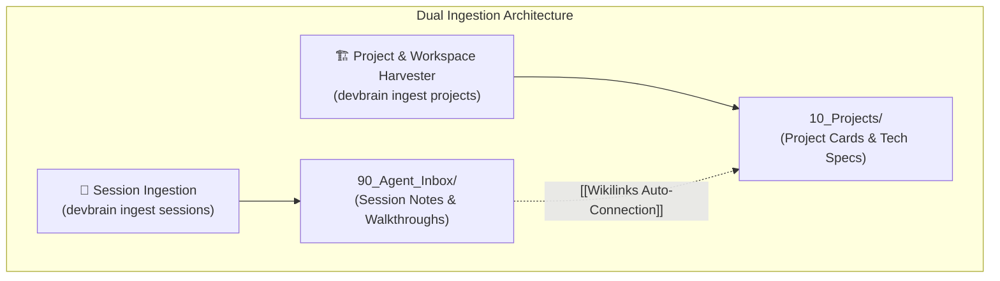

# 27. Workspace Project Harvester dan Auto-Seeding Projek Lokal ke Obsidian

| Metadata | Nilai |
| :--- | :--- |
| **Topik** | Auto-Discovery & Ingest Projek/Repo Lokal ke `10_Projects/` Obsidian |
| **Status** | 💡 Brainstorming & Architectural Proposal |
| **Terkait** | [07-taksonomi-vault-dan-standar-metadata.md](./07-taksonomi-vault-dan-standar-metadata.md), [16-cli-architecture-dan-konsep-obsidian-sebagai-database.md](./16-cli-architecture-dan-konsep-obsidian-sebagai-database.md), [26-otomatisasi-koneksi-graph-wikilinks-dan-entitas.md](./26-otomatisasi-koneksi-graph-wikilinks-dan-entitas.md) |
| **Tanggal** | 2026-08-29 |

---

## 1. Konsep Utama: Ingest Projek vs Ingest Percakapan AI

Selama ini *harvester* fokus pada **Ingest Percakapan & Sesi AI** (`90_Agent_Inbox/`).
Namun, sebuah *Second Brain* seorang *software engineer* tidak hanya berisi catatan percakapan AI, melainkan **Katalog Seluruh Repositori & Projek Koding Aktif** di komputernya.



### Matriks Perbandingan Ingest Sesi AI vs Ingest Projek:
| Aspek | `devbrain ingest` (Sesi AI) | `devbrain ingest projects` (Katalog Repo) |
| :--- | :--- | :--- |
| **Sumber Data** | File internal AI Agent (`~/.gemini/antigravity-ide/brain/`, `~/.claude/projects/`, dll.) | Folder repositori koding fisik di harddisk (misal `E:/_PROJECT/`) |
| **Data yang Diambil** | Ringkasan walkthrough, prompt user, plan arsitektur, dan logs. | Git remote URL, branch aktif, file `README.md`, bahasa, dan daftar *dependencies* (`pyproject.toml`, `package.json`). |
| **Tujuan di Vault** | Disimpan ke **`90_Agent_Inbox/<source>/`** sebagai catatan riwayat log. | Disimpan ke **`10_Projects/<Nama_Projek>/`** sebagai dokumen kartu induk projek. |
| **Peran di Graph View** | Menjadi **node cabang (*leaf node*)**. | Menjadi **simpul sentral (*hub node / matahari*)**. |

---

## 2. Tiga Mode Eksekusi: Apakah Harus Manual & Masukkan Path Tiap Kali?

Untuk mempertahankan prinsip **Zero-Friction**, developer **TIDAK PERLU mengetik path satu per satu**. Kita merancang 3 tingkat fleksibilitas:

### 🌟 Mode 1: 100% Otomatis saat AI Session Ingest (*Zero-Click Auto-Provisioning*)
* Saat menjalankan `devbrain ingest` biasa untuk memanen sesi AI, sistem membaca metadata path kerja (*workspace path*) sesi tersebut (misal: `E:/_PROJECT/_Central AI Brain Hub`).
* Jika folder `10_Projects/_Central AI Brain Hub/` **belum ada di Obsidian**, `devbrain` secara otomatis **mendeteksi, membaca file manifest/README repo tersebut, dan langsung membuatkan kartu projeknya di `10_Projects/`**.
* Kemudian, sesi AI tersebut langsung disambungkan dengan `[[Wikilinks]]` ke kartu projek yang baru dibuat.

### 🛠️ Mode 2: Simpan Default Workspace Root di `.brainrc.json` (*Set-and-Forget*)
Saat pertama kali menjalankan `devbrain init`, pengguna bisa menyimpan path root tempat projek biasa disimpan:
```json
{
  "vault_path": "E:/_PROJECT/_Central AI Brain Hub/vault",
  "workspace_roots": [
    "E:/_PROJECT"
  ]
}
```
Setelah disetel:
* Cukup ketik: `devbrain ingest projects` *(tanpa argumen)* $\rightarrow$ Sistem langsung memindai seluruh folder di dalam `E:/_PROJECT/`.

### 📂 Mode 3: Manual Scan Folder Spesifik (*Ad-Hoc Scan*)
Jika baru saja meng-clone repo di direktori luar (misal di flashdisk atau `D:/Client/`):
```bash
devbrain ingest projects --dir "D:/Client/EcommerceApp"
```

---

## 3. Bagaimana Cara Kerja Pemindaian Repositori?

### A. Indikator Deteksi Repositori Otomatis:
1. **Keberadaan folder `.git/`** $\rightarrow$ Ekstrak URL Remote GitHub/GitLab, branch aktif, dan author.
2. **Manifest Bahasa & Package Manager:**
   * **Python:** `pyproject.toml`, `requirements.txt`, `setup.py`, `Pipfile`
   * **Node/TypeScript:** `package.json`, `pnpm-lock.yaml`, `tsconfig.json`
   * **Rust:** `Cargo.toml`
   * **Golang:** `go.mod`
   * **DevOps/Containers:** `Dockerfile`, `docker-compose.yml`, `kubernetes/`
3. **Dokumentasi Primer:**
   * Membaca `README.md`, `ARCHITECTURE.md`, atau `CONTRIBUTING.md` bawaan repo.

---

## 4. Struktur Output Auto-Seeding di `10_Projects/`

Saat projek di-ingest, sistem otomatis membuat satu subfolder untuk setiap repo di `10_Projects/<Nama_Projek>/README.md`:

```markdown
---
id: "PROJ-CENTRAL-AI-BRAIN-HUB"
title: "Central AI Brain Hub"
type: "project"
status: "active"
language: ["Python", "Markdown"]
stack: ["FastEmbed", "FastMCP", "Typer", "Rich", "Pytest"]
git_remote: "https://github.com/user/central-ai-brain-hub"
local_path: "E:/_PROJECT/_Central AI Brain Hub"
last_scanned: "2026-08-29T15:50:00Z"
tags: [project, python, mcp, fastembed, ai-agent]
---

# 🚀 Central AI Brain Hub

> **Local Path:** `E:/_PROJECT/_Central AI Brain Hub`  
> **Git Remote:** `https://github.com/user/central-ai-brain-hub` (`branch: master`)  
> **Primary Tech Stack:** `Python 3.14` | `FastMCP` | `FastEmbed` | `BM25` | `Typer`

## 📋 Deskripsi & Ringkasan Projek
*(Diekstrak otomatis dari README.md repositori)*:
Central AI Second Brain Hub — Single Source of Truth for Multi-Agent Coding & Obsidian.

## 🛠️ Stack & Dependencies:
- **Core Dependencies:** `mcp >= 2.0.0`, `fastembed >= 0.7.4`, `rank-bm25 >= 0.2.2`, `pydantic >= 2.12.5`
- **CLI & Formatting:** `typer >= 0.24.1`, `rich >= 14.3.3`

## 📜 Riwayat Sesi AI Terkini (Live Dataview):
```dataview
TABLE created, device, title
FROM "90_Agent_Inbox"
WHERE contains(file.text, "_Central AI Brain Hub") OR contains(file.text, "PROJ-CENTRAL-AI-BRAIN-HUB")
SORT created DESC
LIMIT 10
```
```

---

## 5. Manfaat & Nilai Tambah (*Symbiosis Effect*)

1. **Graph View Terhubung Sempurna (*No More Orphan Nodes*):**
   * Setiap kali AI Agent bekerja di repo `E:/_PROJECT/MyApp`, sesi tersebut langsung menautkan diri ke `[[10_Projects/MyApp/README|MyApp]]`.
   * Di Obsidian Graph View, note `MyApp` menjadi **matahari / simpul sentral (*hub node*)** yang dikelilingi oleh seluruh sesi koding, ADR, dan knowledge terkait.
2. **Konteks Instan untuk AI Agent (`get_project_context`):**
   * Saat AI Agent baru membuka proyek, tool MCP `get_project_context(project_name="MyApp")` langsung memberikan ringkasan arsitektur, stack, dan riwayat keputusan tanpa perlu membaca ulang seluruh codebase dari nol!
3. **Zero Maintenance Knowledge Catalog:**
   * Developer tidak perlu mengetik ulang daftar projek di Obsidian satu per satu. Cukup satu perintah `devbrain ingest projects`, seluruh puluhan repositori di komputer langsung terpetakan rapi ke dalam Obsidian!

---

## 6. Rencana Perintah CLI Lengkap

```bash
# 1. Ingest sesi percakapan AI + Auto-provisioning project card jika belum ada
devbrain ingest

# 2. Batch ingest seluruh project/repo di workspace root (.brainrc.json)
devbrain ingest projects

# 3. Ingest repo dari direktori spesifik
devbrain ingest projects --dir "D:/CustomProjects/MyRepo"

# 4. Full scan: Ingest seluruh project fisik + seluruh sesi AI sekaligus
devbrain ingest all
```
