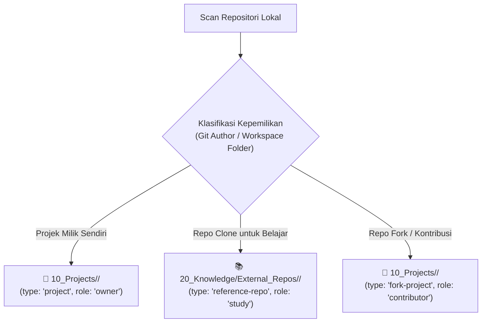

# 28. Klasifikasi Projek Internal vs External Cloned Repositori (Knowledge Reference)

| Metadata | Nilai |
| :--- | :--- |
| **Topik** | Penanganan Projek Hasil Clone / Pihak Ketiga vs Projek Internal |
| **Status** | 💡 Brainstorming & Taxonomy Standard |
| **Terkait** | [07-taksonomi-vault-dan-standar-metadata.md](./07-taksonomi-vault-dan-standar-metadata.md), [27-workspace-project-harvester-dan-auto-seeding.md](./27-workspace-project-harvester-dan-auto-seeding.md) |
| **Tanggal** | 2026-08-29 |

---

## 1. Latar Belakang Masalah: Dilema Repositori Kloning

Di komputer seorang *software engineer*, terdapat berbagai jenis repositori:
1. **Projek Internal / Milik Sendiri:** Projek kantor, aplikasi freelance, atau produk SaaS pribadi yang sedang aktif dikembangkan.
2. **Projek Open-Source / Pihak Ketiga (Cloned):** Repositori publik (misal: `fastapi`, `langgraph`, `shadcn-ui`, atau repo riset AI) yang di-clone untuk dipelajari arsitektur kodenya.
3. **Projek Fork / Kontribusi:** Repositori orang lain yang kita fork untuk membuat *Pull Request* / kontribusi open-source.

### Dilema:
* Jika **seluruh repo hasil clone** dimasukkan ke `10_Projects/`, folder projek aktif akan dipenuhi puluhan repo luar yang bukan tanggung jawab kerja kita (*dashboard clutter*).
* Namun jika **tidak di-ingest sama sekali**, kita kehilangan kesempatan emas untuk menjadikan codebase referensi tersebut sebagai **basis pengetahuan cerdas (*knowledge base*)** yang dapat di-query oleh AI Agent kita.

---

## 2. Solusi: Pemisahan Taksonomi Berdasarkan Peran Repositori



---

## 3. Matriks Klasifikasi Metadata

| Kategori | Lokasi Vault | Metadata `type:` & `role:` | Deskripsi & Tujuan |
| :--- | :--- | :--- | :--- |
| **Active Project (Own)** | `10_Projects/<Project_Name>/README.md` | `type: "project"`<br/>`role: "owner"` | Menyimpan roadmap, tasks, arsitektur internal, dan riwayat sesi koding AI. |
| **Forked Contributor** | `10_Projects/<Project_Name>/README.md` | `type: "fork-project"`<br/>`role: "contributor"` | Melacak issue/PR yang sedang kita kerjakan untuk komunitas open-source. |
| **Study / Reference Clone** | `20_Knowledge/External_Repos/<Repo_Name>/README.md` | `type: "reference-repo"`<br/>`role: "study"` | Menyimpan ringkasan arsitektur, manifest library, dan code pattern referensi. |

---

## 4. Keuntungan Meng-ingest Repo Referensi ke `20_Knowledge/`

1. **Pencarian Kode & Pattern Instan bagi AI Agent (`search_brain`):**
   * Saat developer atau AI Agent membutuhkan contoh: *"Bagaimana implementasi JWT refresh token di FastAPI?"*, AI dapat langsung memanggil tool `search_brain("jwt refresh pattern")` dan mendapatkan ringkasan dari repo referensi lokal tanpa perlu browsing GitHub.
2. **Kartu Pengetahuan Ringan (*Lightweight Knowledge Cards*):**
   * Harvester **tidak meng-copy ribuan file source code mentah**, melainkan mengekstrak:
     * Deskripsi projek dari root `README.md`.
     * Daftar dependensi dan stack teknologi (`pyproject.toml`, `package.json`).
     * Arsitektur direktori utama.
   * Hal ini menjaga Obsidian Vault tetap berukuran kecil dan pencarian tetap sub-detik (<20ms).

---

## 5. Algoritma Deteksi Otomatis di `devbrain`

`devbrain` dapat mengenali kategori repo secara otomatis menggunakan 3 lapisan aturan (*heuristics*):

1. **Git Author Matching:**
   * Memeriksa apakah `git config user.email` lokal cocok dengan author commit pada riwayat repo.
   * Jika tidak ada commit dari developer dan repo memiliki remote publik $\rightarrow$ Ditandai otomatis sebagai `type: "reference-repo"`.
2. **Folder Path Convention:**
   * Path mengandung `/learning/`, `/references/`, `/clones/`, `/study/` $\rightarrow$ Masuk ke `20_Knowledge/External_Repos/`.
   * Path mengandung `/work/`, `/_PROJECT/` aktif $\rightarrow$ Masuk ke `10_Projects/`.
3. **CLI Manual Override:**
   ```bash
   # Ingest spesifik sebagai referensi studi
   devbrain ingest projects --dir "E:/_PROJECT/learning/fastapi" --as-reference

   # Ingest spesifik sebagai projek milik sendiri
   devbrain ingest projects --dir "E:/_PROJECT/my-app" --as-project
   ```
