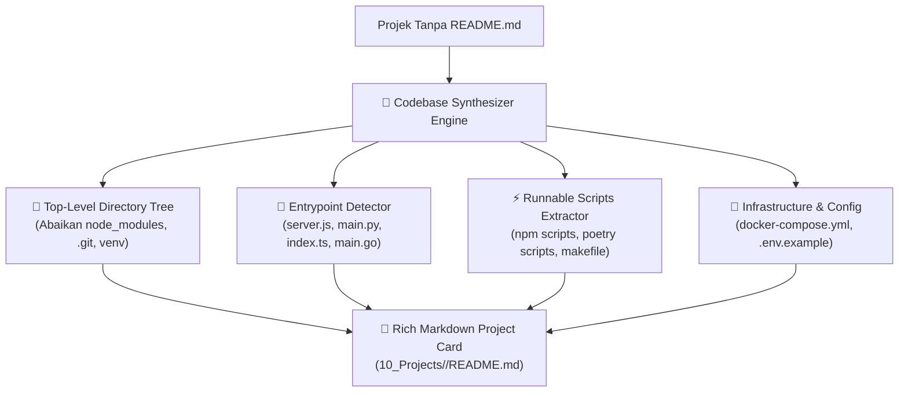

# 29. Auto-Sintesis Arsitektur Projek Tanpa README & Deteksi Multi-Project Container

| Metadata | Nilai |
| :--- | :--- |
| **Topik** | Auto-Generating Project Architecture & Scripts for README-less Repositories |
| **Status** | 💡 Brainstorming & Architecture Design |
| **Terkait** | [27-workspace-project-harvester-dan-auto-seeding.md](./27-workspace-project-harvester-dan-auto-seeding.md), [28-klasifikasi-projek-internal-vs-external-cloned-repos.md](./28-klasifikasi-projek-internal-vs-external-cloned-repos.md) |
| **Tanggal** | 2026-08-29 |

---

## 1. Latar Belakang Masalah

Dalam penggunaan nyata di lapangan, banyak folder koding di laptop developer yang memiliki kondisi:
1. **Tidak Ada File `README.md`:** Developer langsung ngoding tanpa membuat file dokumentasi awal. Akibatnya kartu projek yang di-ingest menjadi kosong (*"No description provided"*).
2. **Folder Induk / Workspace Container:** Folder seperti `E:\_PROJECT\_fxmedia` yang di dalamnya berisi beberapa sub-projek (`neo4j-express-demo`, `qdrant-local-demo`), tetapi di root foldernya tidak ada file kode manifest sehingga terdeteksi sebagai `UNKNOWN`.

---

## 2. Solusi 1: Codebase Synthesizer Engine (Untuk Projek Tanpa README)

Jika tidak ditemukan file `README.md`, sistem **`devbrain` tidak boleh menyerah**. Sistem harus secara proaktif melakukan **inspeksi statis terhadap kode dan struktur direktori**:



### Format Kartu Projek Hasil Auto-Sintesis:

```markdown
---
id: "PROJ-NEO4J-EXPRESS-DEMO"
title: "neo4j-express-demo"
type: "project"
role: "owner"
status: "active"
language: ["JavaScript"]
stack: ["Express", "Docker"]
git_remote: ""
local_path: "E:/_PROJECT/_fxmedia/neo4j-express-demo"
tags: ["project", "codebase"]
---

# 🚀 neo4j-express-demo

> **Local Path:** `E:\_PROJECT\_fxmedia\neo4j-express-demo`  
> **Tech Stack:** `JavaScript` | `Express` | `Docker`  
> **Entrypoints:** `server.js`

## 📋 Auto-Synthesized Overview
A Node.js/Express application detected with active services (`server.js`, `docker-compose.yml`).

---

## ⚡ Runnable Scripts:
- `npm run dev` → `nodemon server.js`
- `npm start` → `node server.js`

---

## 🌳 Project Structure:
```
neo4j-express-demo/
├── docs/
├── public/
├── .env.example
├── docker-compose.yml
├── package.json
└── server.js
```

---

## 🛠️ Key Dependencies:
- `express`
- `neo4j-driver`
- `dotenv`

---

## 📜 Riwayat Sesi AI Terkini (Live Dataview):
```dataview
TABLE created, device, title
FROM "90_Agent_Inbox"
WHERE contains(file.text, "neo4j-express-demo")
SORT created DESC
LIMIT 10
```
```

---

## 3. Solusi 2: Deteksi Cerdas Workspace Container / Multi-Project Folder

Jika pengguna menjalankan `devbrain ingest project <folder>` pada folder induk (seperti `_fxmedia`) yang tidak memiliki manifest di root tetapi memiliki sub-projek di dalamnya:

1. **Auto-Delegation Heuristic:**
   * Sistem mendeteksi bahwa folder root tidak memiliki manifest, tetapi memiliki 2 atau lebih subfolder yang merupakan repositori/projek koding.
2. **Tindakan Otomatis:**
   * Mengubah aksi secara transparan menjadi **Batch Multi-Project Ingest**, memindai seluruh subfolder di dalamnya, dan membuatkan kartu projek untuk masing-masing sub-projek secara otomatis.
   * Memberikan pesan informatif di terminal:
     `ℹ️ Detected multi-project container folder. Automatically scanned and ingested 3 sub-projects.`
