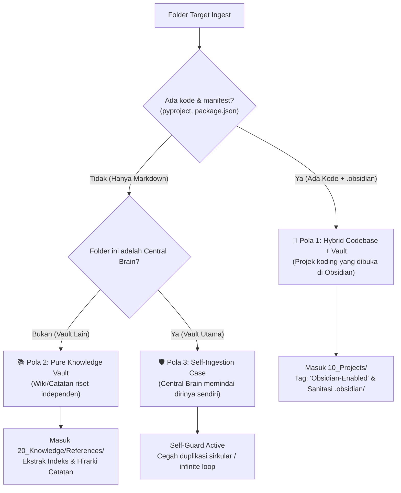

# 30. Penanganan Folder Projek yang Menjadi Vault Obsidian (Terdapat `.obsidian/`)

| Metadata | Nilai |
| :--- | :--- |
| **Topik** | Handling Project Folders Containing `.obsidian/` Directory & Self-Ingestion Guard |
| **Status** | 💡 Brainstorming & Architecture Design |
| **Terkait** | [27-workspace-project-harvester-dan-auto-seeding.md](./27-workspace-project-harvester-dan-auto-seeding.md), [28-klasifikasi-projek-internal-vs-external-cloned-repos.md](./28-klasifikasi-projek-internal-vs-external-cloned-repos.md), [29-auto-sintesis-arsitektur-projek-tanpa-readme.md](./29-auto-sintesis-arsitektur-projek-tanpa-readme.md) |
| **Tanggal** | 2026-08-29 |

---

## 1. Latar Belakang Masalah

Dalam alur kerja developer modern, sering ditemukan folder projek yang di dalamnya terdapat folder **`.obsidian/`**. Ada 3 skenario umum di mana hal ini terjadi:

---

## 2. Analisis 3 Pola Kasus & Solusi Arsitekturnya

### 📌 Pola 1: Hybrid Codebase + Vault (Projek Koding yang Dibuka di Obsidian)
* **Karakteristik:** Memiliki file manifest koding (`package.json`, `pyproject.toml`, `server.js`, `src/`) sekaligus memiliki folder `.obsidian/` karena developer membuka root projek di Obsidian untuk menulis dokumentasi internal.
* **Perlakuan `devbrain`:**
  1. **Klasifikasi:** Tetap diklasifikasikan sebagai **`RepoType.PROJECT`** (`10_Projects/`).
  2. **Metadata Tag:** Menambahkan atribut `obsidian_vault: true` dan tag `stack: ["Obsidian-Enabled", ...]`.
  3. **Strict Ignore Filter:** Folder `.obsidian/` (berisi `workspace.json`, `app.json`, cache plugin) **100% DIABAIKAN / TIDAK DIINDEKS** oleh `tree_analyzer.py` dan `hybrid_search.py` agar tidak mencemari memori vektor Central Brain dengan data konfigurasi UI Obsidian.
  4. **Dokumentasi Terintegrasi:** Jika di dalam projek ada folder `docs/` atau catatan `.md`, `project_harvester` mendaftar dokumen-dokumen utama tersebut ke dalam kartu projek `10_Projects/<Project>/README.md`.

---

### 📚 Pola 2: Pure Knowledge Vault (Bukan Koding, Murni Kumpulan Catatan)
* **Karakteristik:** Berisi banyak file `.md`, terdapat folder `.obsidian/`, tetapi **tidak ada manifest kode program**. Contoh: `Personal_Wiki`, `Buku_Catatan_Kuliah`, `Jurnal_Riset`.
* **Perlakuan `devbrain`:**
  1. **Klasifikasi:** Masuk ke **`20_Knowledge/References/<Nama_Vault>/`** (`type: "knowledge-vault"`).
  2. **Reason:** *"Dedicated External Obsidian Vault."*
  3. **Indeks Otomatis:** Catatan-catatan penting di dalam vault tersebut dapat diindeks ke dalam pencarian semantik Central Brain Hub tanpa perlu memindahkan struktur fisiknya.

---

### 🛡️ Pola 3: Self-Ingestion Guard (Central Brain Memindai Dirinya Sendiri)
* **Karakteristik:** Pengguna menjalankan `devbrain ingest projects --dir "E:/_PROJECT"` dan di dalam folder `_PROJECT` terdapat folder `_Central AI Brain Hub` (Vault Central Brain itu sendiri).
* **Risiko Jika Tidak Dijaga:**
  * Terjadi *infinite loop* atau rekursi sirkular (Central Brain membuat kartu projek tentang Central Brain di dalam Central Brain, yang kemudian terindeks lagi sebagai catatan baru).
* **Solusi Perlindungan (*Self-Ingestion Guard*):**
  * Di `service.py`: Memeriksa apakah `repo_path.resolve() == self.vault_path.resolve()`.
  * Jika sama, `devbrain` menandainya sebagai **`Central Brain Core Hub`** dan hanya membuat/memperbarui kartu status tanpa memicu duplikasi rekursif.

---

## 3. Aturan Sanitasi & Filter Folder `.obsidian/`

Folder `.obsidian/` berisi file internal aplikasi Obsidian:
* `.obsidian/workspace.json` (posisi tab dan ukuran jendela)
* `.obsidian/graph.json` (pengaturan warna graf)
* `.obsidian/plugins/` (file binary dan JS plugin)
* `.obsidian/cache/` (cache internal)

### Aturan Baku:
1. **Daftar Hitam di `tree_analyzer.py`:** `.obsidian` wajib dimasukkan ke dalam `IGNORED_DIRECTORIES`.
2. **Daftar Hitam di `parser.py` / `hybrid_search.py`:** Engine pencarian tidak boleh mengindeks file apapun di dalam `.obsidian/`.
3. **Daftar Hitam di `.brainignore`:** Secara default di-ignore dari pemindaian.

---

## 4. Kesimpulan & Rekomendasi

1. Folder projek yang berisi `.obsidian/` adalah hal yang lumrah dan sangat valid.
2. Jika ada kode $\rightarrow$ Masuk **`10_Projects/`** (dengan badge *Obsidian-Enabled*).
3. Jika murni catatan $\rightarrow$ Masuk **`20_Knowledge/References/`** (sebagai *External Knowledge Vault*).
4. Folder `.obsidian/` selalu difilter secara ketat agar tidak mengotori search engine dan ASCII Tree.
5. Ditambahkan *Self-Ingestion Guard* agar Central Brain aman saat memindai folder kerjanya sendiri.
