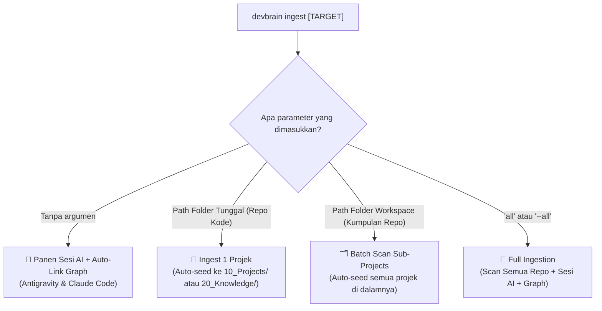
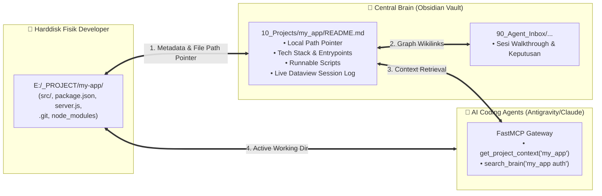

# 31. Penyederhanaan UX CLI Ingest & Mekanisme Koneksi Folder Projek Fisik ke Obsidian Vault

| Metadata | Nilai |
| :--- | :--- |
| **Topik** | Unified CLI Ingest UX (DWIM Principle) & Physical Project-to-Vault Connection Architecture |
| **Status** | 💡 Brainstorming & Architecture Design |
| **Terkait** | [27-workspace-project-harvester-dan-auto-seeding.md](./27-workspace-project-harvester-dan-auto-seeding.md), [29-auto-sintesis-arsitektur-projek-tanpa-readme.md](./29-auto-sintesis-arsitektur-projek-tanpa-readme.md), [30-penanganan-folder-projek-berisi-vault-obsidian.md](./30-penanganan-folder-projek-berisi-vault-obsidian.md) |
| **Tanggal** | 2026-08-29 |

---

## 1. Masalah 1: Kompleksitas & Kebingungan CLI `devbrain ingest`

### Mengapa Perintah Sebelumnya Membingungkan?
1. **Pemisahan `project` (tunggal) vs `projects` (jamak):** User harus berpikir apakah folder yang ditunjuk adalah 1 repo mandiri atau kumpulan repo.
2. **Inkonsistensi Argumen:** `ingest project <path>` menggunakan *positional argument*, sedangkan `ingest projects --dir <path>` menggunakan *option flag*. Jika user mengetik `--dir` pada `ingest project`, perintah langsung error.
3. **Banyaknya Nama Perintah:** `ingest`, `ingest project`, `ingest projects`, `ingest all`, `pull`.

---

## 2. Solusi Desain UX Baru: *Unified Ingest ("Do What I Mean" / DWIM)*

Kita menyederhanakan seluruh alur ingest menjadi **1 Format Universal yang Cerdas**:

```bash
# FORMAT UNIVERSAL:
devbrain ingest [PATH_ATAU_TARGET] [OPSI...]
```



### Keunggulan Desain Universal Ini:
1. **Fleksibel & Toleran terhadap Opsi:** Mau diketik `devbrain ingest "E:\Folder"`, `devbrain ingest --dir "E:\Folder"`, maupun `devbrain ingest --path "E:\Folder"`, semuanya **berhasil dieksekusi secara seragam**.
2. **Auto-Detect Scope:** Sistem otomatis memeriksa apakah folder tersebut adalah 1 repo tunggal atau folder induk workspace, tanpa perlu memaksa user memilih `project` vs `projects`.
3. **Tetap Mendukung Sub-perintah (Backward Compatible):** Bagi script otomatisasi, sub-perintah lama tetap berjalan normal.

---

## 3. Masalah 2: Bagaimana Sebenarnya Hubungan Folder Projek Fisik dengan Vault Obsidian?

Pertanyaan mendasar: *"Saat kita meng-ingest projek, apakah folder koding fisik tersebut dihubungkan ke vault Obsidian?"*

Jawabannya: **Ya, terhubung melalui 4 Lapisan Koneksi (*4-Layer Bridge Architecture*)**:



---

## 4. Rincian 4 Lapisan Koneksi Projek Fisik ke Vault

### 🔗 Lapisan 1: Pointer & Architecture Map (Anti-Pollution Principle)
* **Mengapa folder koding tidak di-copy seluruhnya ke dalam Obsidian?**
  * Folder koding berisi `node_modules/`, binary, build artifacts, dan ratusan ribu file kecil. Jika dimasukkan langsung ke Obsidian, Obsidian akan menjadi **sangat lambat (*laggy*)**, pencarian vektor memori AI menjadi kotor, dan sync cloud menjadi rusak.
* **Solusi DevBrain:** Obsidian menyimpan **Executive Architecture Hub & Summary Map** (`10_Projects/<Project>/README.md`) yang menyimpan pointer path absolut:
  ```yaml
  local_path: "E:/_PROJECT/_fxmedia/neo4j-express-demo"
  git_remote: "https://github.com/..."
  ```

### 🔗 Lapisan 2: Interactive IDE Deep Links (1-Click Open)
Di dalam kartu projek Obsidian, kita sediakan tautan langsung untuk membuka projek di editor:
* `[🚀 Buka di VS Code / Antigravity](vscode://file/E:/_PROJECT/_fxmedia/neo4j-express-demo)`
* `[📁 Buka di Windows Explorer](file:///E:/_PROJECT/_fxmedia/neo4j-express-demo)`
*(Developer cukup klik tautan tersebut di Obsidian, folder projek fisik langsung terbuka di IDE!)*

### 🔗 Lapisan 3: AI Agent Memory Bridge (`get_project_context`)
Saat developer sedang ngoding di folder fisik `E:\_PROJECT\my-app` bersama Antigravity atau Claude Code:
1. Agent memanggil `get_project_context("my-app")` ke FastMCP server.
2. FastMCP membaca `10_Projects/my_app/README.md` di Obsidian dan menyuplai arsitektur, tech stack, aturan, serta riwayat sesi AI sebelumnya ke memori agen secara *just-in-time*.

### 🔗 Lapisan 4: Real-time Ingestion & Graph Mesh
Setiap kali AI menyelesaikan sesi koding di folder fisik projek tersebut, `devbrain ingest` secara otomatis menyerap percakapan dan **menghubungkannya dengan simpul kartu projek di Obsidian Graph**.

---

## 5. Kesimpulan & Rencana Aksi

1. **Sederhanakan CLI:** Jadikan `devbrain ingest [PATH]` universal (bisa menerima path single repo, workspace folder, opsi `--dir`, `--path`, maupun tanpa argumen).
2. **Perkaya Kartu Projek:** Tambahkan tombol klik langsung (*IDE Deep Link*) `vscode://file/...` dan `file:///...` pada setiap kartu projek di `10_Projects/`.
3. **Dokumentasi Visual:** Jelaskan 4 lapisan koneksi ini di `README.md` dan panduan developer agar tidak ada kerancuan antara file fisik dan catatan Obsidian.
