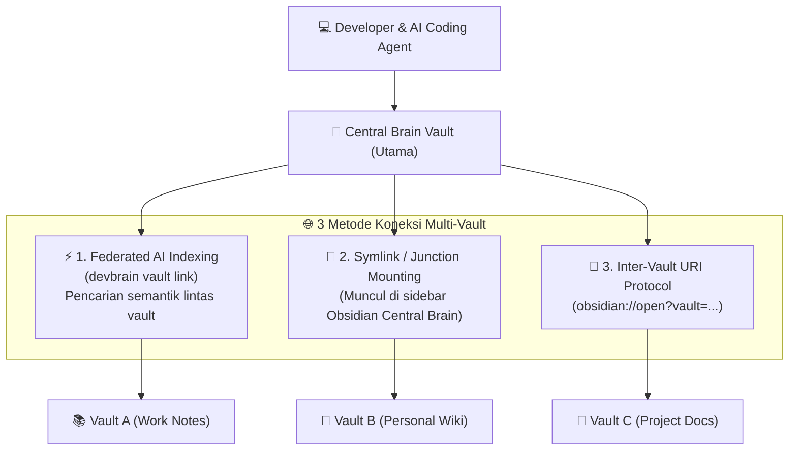

# 32. Multi-Vault Federation & Command `devbrain vault link`

| Metadata | Nilai |
| :--- | :--- |
| **Topik** | Multi-Vault Architecture, Federated Semantic Search & Command `devbrain vault link` |
| **Status** | 💡 Brainstorming & Architecture Design |
| **Terkait** | [15-multi-vault-dan-strategi-adopsi-existing-vault.md](./15-multi-vault-dan-strategi-adopsi-existing-vault.md), [30-penanganan-folder-projek-berisi-vault-obsidian.md](./30-penanganan-folder-projek-berisi-vault-obsidian.md), [31-penyederhanaan-ux-cli-ingest-dan-koneksi-fisik-projek-ke-vault.md](./31-penyederhanaan-ux-cli-ingest-dan-koneksi-fisik-projek-ke-vault.md) |
| **Tanggal** | 2026-08-29 |

---

## 1. Analogi Dasar: Obsidian Vault sebagai Database Terdistribusi

Analogi Anda **sangat tepat dan akurat**:

| Komponen Database Tradisional | Padanan di Obsidian Vault |
| :--- | :--- |
| **Database Instance / Server** | **Vault Root Folder** (Parent directory yang memuat `.obsidian/`) |
| **Tables / Collections** | **Subfolder Taksonomi** (`10_Projects/`, `20_Knowledge/`, `90_Agent_Inbox/`) |
| **Records / Rows / Documents** | **File Markdown (`.md`)** |
| **Schema / Columns / Index** | **YAML Frontmatter Properties** (`id`, `title`, `tags`, `status`, `type`) |
| **Foreign Keys / Graph Edges** | **`[[Wikilinks]]`** yang menghubungkan antar file/node |
| **Query Engine** | **Dataview Plugin / FastMCP Hybrid Search Engine** |

---

## 2. Masalah di Dunia Nyata: *Multi-Vault Landscape*

Developer sering kali tidak hanya memiliki 1 vault, melainkan beberapa vault terpisah di komputernya:
1. **Central Brain Vault (Utama):** Vault yang dibuat via `devbrain init` sebagai pusat memori AI dan SSOT.
2. **Vault Catatan Kantor (`E:/Work_Notes_Vault`):** Berisi notulen rapat, SOP tim, dan arsitektur kantor.
3. **Vault Riset Pribadi (`E:/Personal_Knowledge_Vault`):** Berisi ringkasan buku, jurnal, dan ide riset.
4. **Vault Dokumentasi Projek (`E:/_PROJECT/App/docs_vault`):** Vault lokal di dalam folder projek tertentu.

### Pertanyaan Kunci:
> *"Bagaimana cara menghubungkan vault-vault eksternal tersebut ke Central Brain tanpa memindahkan file aslinya dan tanpa membuat duplikasi data?"*

---

## 3. Tiga Paradigma Menghubungkan Multi-Vault ke Central Brain



---

### ⚡ Metode 1: Federated Semantic Search & Memory (`devbrain vault link`)
* **Konsep:** Kita mendaftarkan path vault-vault eksternal ke dalam konfigurasi `.brainrc.json` Central Brain.
* **Format Perintah CLI:**
  ```bash
  # Menghubungkan vault eksternal
  devbrain vault link "E:/Work_Notes_Vault" --alias "work-vault"
  devbrain vault link "E:/_PROJECT/_TEST/HowToBeAProgrammer" --alias "how-to-programmer"

  # Melihat daftar vault yang terhubung
  devbrain vault list

  # Memutuskan koneksi vault
  devbrain vault unlink "work-vault"
  ```
* **Cara Kerja di Belakang Layar:**
  1. `.brainrc.json` menyimpan dictionary `linked_vaults`:
     ```json
     {
       "vault_path": "E:/_PROJECT/_Central AI Brain Hub/demo_vault",
       "linked_vaults": {
         "work-vault": "E:/Work_Notes_Vault",
         "how-to-programmer": "E:/_PROJECT/_TEST/HowToBeAProgrammer"
       }
     }
     ```
  2. **Federated Search Engine:** Saat AI agent menjalankan tool FastMCP `search_brain("aturan auth JWT")` atau developer menjalankan `devbrain search`, engine secara cerdas memindai indeks Central Vault **sekaligus semua Linked Vaults secara serentak**!
  3. **Zero Storage Redundancy:** 0 MB kapasitas harddisk terbuang karena file fisik tidak di-copy.

---

### 📁 Metode 2: Obsidian Symlink / Directory Junction (Visual Sidebar Mount)
* **Konsep:** Menghubungkan folder fisik vault eksternal ke dalam direktori `20_Knowledge/Linked_Vaults/<alias>/` di Central Brain menggunakan Windows Directory Junction (`mklink /J`) atau symlink POSIX.
* **Hasil di Aplikasi Obsidian:**
  1. Saat developer membuka Central Brain di Obsidian, folder `work-vault` langsung muncul di **File Explorer Sidebar** Central Brain.
  2. Catatan di dalam vault eksternal bisa langsung diedit, dan perubahan fisik langsung tersimpan ke folder aslinya.
  3. **Graph View:** Simpul catatan dari vault eksternal langsung tergambar di Graph View Central Brain dan bisa ditautkan menggunakan `[[Wikilinks]]`!

---

### 🔗 Metode 3: Inter-Vault URI Protocol (1-Click Switch Vault)
* Obsidian mendukung protokol tautan antar vault:
  ```markdown
  [📖 Buka di Obsidian Vault Kantor](obsidian://open?vault=Work_Notes_Vault&file=Arsitektur%20Microservices)
  ```
* Developer cukup mengklik link tersebut di Central Brain, maka Obsidian akan membuka jendela vault kantor tersebut secara instan.

---

## 4. Desain Perintah CLI `devbrain vault`

Untuk mewujudkan integrasi multi-vault ini, kita merancang sub-aplikasi CLI **`devbrain vault`**:

```text
Usage: devbrain vault [OPTIONS] COMMAND [ARGS]...

Commands:
  link      Hubungkan vault eksternal ke Central Brain (Federated Memory + Mount).
  unlink    Putuskan koneksi vault eksternal tanpa menghapus file aslinya.
  list      Tampilkan seluruh vault yang terhubung beserta jumlah catatannya.
  sync      Sinkronisasi dan re-index seluruh linked vaults secara serempak.
```

### Contoh Skenario Penggunaan Nyata:
```bash
# 1. Hubungkan vault catatan kantor
devbrain vault link "D:/Kantor/Obsidian_Work" --alias "office" --mount

# 2. Cari solusi bug di seluruh vault sekaligus
devbrain search "solusi memory leak redis" --scope all

# 3. AI Agent di Antigravity otomatis bisa membaca context dari kedua vault:
# search_brain("standar deploy docker", scope="office")
```

---

## 5. Kesimpulan & Rekomendasi

1. **Sangat Memungkinkan & Sangat Berguna:** `devbrain` dapat bertindak sebagai **Central Aggregator / Federation Hub** yang menyatukan puluhan vault terpisah di komputer Anda ke dalam 1 AI Memory tunggal.
2. **Kombinasi Terbaik:** 
   * **Federated Vector Indexing** untuk memori AI (FastMCP `search_brain` & `get_project_context`).
   * **Directory Junction (`--mount`)** untuk tampilan visual di Obsidian Sidebar dan Graph View.
   * **Zero File Duplication** (file tetap di lokasi aslinya).
