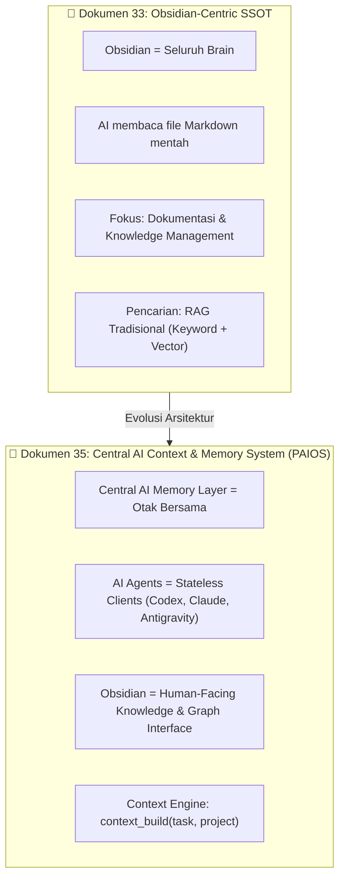

# 37. Sintesis Arsitektur: Dari Obsidian SSOT Menuju Central AI Context & Memory System (PAIOS)

| Metadata | Nilai |
| :--- | :--- |
| **Topik** | Sintesis Mendalam Dokumen 33 & 35: Paradigma Central AI Context Layer, Dual-Layer Storage (Obsidian + SQLite), 5-Tier Memory Model & `context_build()` Engine |
| **Status** | 💡 Brainstorming & Architectural Breakthrough |
| **Referensi** | [33.md](./33.md), [34-analisis-komparasi-arsitektur-ssot-ai-agent.md](./34-analisis-komparasi-arsitektur-ssot-ai-agent.md), [35.md](./35.md), [36-katalog-ingesti-mekanisme-harvester-dan-efisiensi-resource.md](./36-katalog-ingesti-mekanisme-harvester-dan-efisiensi-resource.md) |
| **Tanggal** | 2026-08-30 |

---

## 1. Pergeseran Paradigma: Evolusi Dokumen 33 $\rightarrow$ Dokumen 35



### Inti Perbedaan Paradigma:
1. **Dokumen 33** memandang sistem sebagai *"Obsidian Vault yang dibaca oleh AI"*.
2. **Dokumen 35** memandang sistem sebagai **"Central AI Context & Memory System"** di mana:
   > **"AI Agent bukan tempat memory disimpan. Agent hanyalah client yang datang dan pergi (*stateless*), sedangkan memori, preferensi user, keputusan arsitektur, dan konteks projek hidup abadi di Central Memory."**
   > **Obsidian tetap menjadi antarmuka visual utama bagi manusia (Human-in-the-loop).**

---

## 2. Model 5-Tier Context & Memory Architecture

Dokumen 35 memecah konteks AI menjadi 5 domain terpisah yang sangat terstruktur:

```text
┌─────────────────────────────────────────────────────────────────────────┐
│                     CENTRAL AI MEMORY & CONTEXT HUB                     │
├───────────────────┬─────────────────────────────────────────────────────┤
│ 1. USER MEMORY    │ Preferensi koding (TS > JS), bahasa, gaya respon,   │
│                   │ tujuan jangka panjang, aturan global.               │
├───────────────────┼─────────────────────────────────────────────────────┤
│ 2. PROJECT MEMORY │ Status projek aktif, tech stack, arsitektur,       │
│                   │ runnable scripts, branch git, entrypoints.          │
├───────────────────┼─────────────────────────────────────────────────────┤
│ 3. KNOWLEDGE BASE │ Dokumentasi teknologi, library guides, how-to       │
│                   │ (tempat Obsidian Markdown & Graph sangat unggul).   │
├───────────────────┼─────────────────────────────────────────────────────┤
│ 4. DECISION (ADR) │ Architecture Decision Records (Mengapa kita memilih │
│                   │ PostgreSQL daripada MongoDB? Trade-offs & dates).   │
├───────────────────┼─────────────────────────────────────────────────────┤
│ 5. SESSION MEMORY │ Log pengerjaan sesi terakhir, task checklist,       │
│                   │ diff ringkasan, deduplikasi & lifecycle memori.     │
└───────────────────┴─────────────────────────────────────────────────────┘
```

---

## 3. Fitur Paling Revolusioner: `context_build()` (Melampaui RAG Biasa)

RAG tradisional hanya mencari potongan teks (*chunks*) yang mirip kata kunci. Dokumen 35 mengusulkan **Context Assembly Engine (`context_build`)**:

```text
User Request: "Implement payment system in ecommerce project"
                            │
                            ▼
              ┌───────────────────────────┐
              │ context_build(task, proj) │
              └─────────────┬─────────────┘
                            │
        ┌───────────────────┼───────────────────┐
        ▼                   ▼                   ▼
[User Preferences]  [Project State]     [Decisions & ADR]
• TypeScript        • Next.js + Laravel • ADR-003: Stripe API
• Clean Code        • Active Branch     • ADR-008: JWT session
        │                   │                   │
        └───────────────────┼───────────────────┘
                            ▼
                  [Relevant Knowledge]
                  • Laravel Sanctum
                  • Webhook handlers
                            │
                            ▼
     ┌───────────────────────────────────────────────┐
     │           SITUATIONAL AWARENESS CARD          │
     │ Dikirim ke Agent (Antigravity / Claude Code)  │
     └───────────────────────────────────────────────┘
```

Agent tidak perlu membaca 3.000 file markdown yang menghabiskan token context window, melainkan langsung menerima **ringkasan situasional yang tepat sasaran (*hyper-targeted context*)**.

---

## 4. Arsitektur Dual-Layer Storage (Human Layer + Machine Layer)

```text
                  ┌──────────────────────────────┐
                  │    HUMAN LAYER (Obsidian)    │
                  │  • Pure Markdown (.md)       │
                  │  • Visual Graph View         │
                  │  • Dataview Dashboards       │
                  │  • Human-editable & Git      │
                  └──────────────┬───────────────┘
                                 │
                            Sync & Index
                                 │
                                 ▼
                  ┌──────────────────────────────┐
                  │    MACHINE LAYER (DevBrain)  │
                  │  • FastEmbed ONNX Vectors    │
                  │  • Rank-BM25 Sparse Index    │
                  │  • SQLite / Structured State │
                  │  • Confidence & Scopes       │
                  └──────────────┬───────────────┘
                                 │
                                 ▼
                  ┌──────────────────────────────┐
                  │     FastMCP & Universal CLI  │
                  │  • search_brain()            │
                  │  • get_project_context()     │
                  │  • build_task_context()      │
                  │  • record_memory()           │
                  └──────────────────────────────┘
```

---

## 5. Matriks Scope & Lifecycle Memori

Agar memori AI tidak menjadi "tempat sampah obrolan" yang penuh noise, Dokumen 35 mendefinisikan **Memory Scope & Lifecycle**:

| Scope Level | Contoh Isi Memori | Masa Berlaku / Target |
| :--- | :--- | :--- |
| **`GLOBAL`** | "User menyukai penjelasan ringkas & kode modular." | Berlaku di semua project & semua agent. |
| **`PROJECT`** | "Project ini menggunakan pnpm dan Docker Compose." | Berlaku untuk semua agent saat membuka repo ini. |
| **`TASK`** | "Sedang me-refactor modul auth; jangan ubah file schema database." | Berlaku selama task tersebut berjalan. |
| **`SESSION`** | "Tadi malam baru saja memodifikasi middleware token." | Berlaku sebagai konteks kerja terkini. |

---

## 6. Roadmap Penerapan Ide 33 & 35 ke DevBrain (`v1.6.0+`)

| Komponen Baru | Sumber Ide | Implementasi di DevBrain |
| :--- | :--- | :--- |
| **1. ADR Manager (`devbrain adr`)** | Dokumen 33 & 35 | Folder `30_Decisions/`, CLI `devbrain adr new`, MCP `get_decisions()`. |
| **2. Context Engine (`context_build`)** | Dokumen 35 | MCP Tool `build_task_context(task, project)` & CLI `devbrain context`. |
| **3. User Preference Memory** | Dokumen 35 | File `00_System/User_Preferences.md` & MCP `get_user_context()`. |
| **4. Workspace Rules Generator** | Dokumen 33 | CLI `devbrain rules init` $\rightarrow$ auto-generate `AGENTS.md` & `CLAUDE.md`. |
| **5. Multi-Scope Memory Store** | Dokumen 35 | Klasifikasi tag metadata (`scope: global | project | session`). |

---

## 7. Kesimpulan

Mempelajari Dokumen 33 dan 35 memberikan **kejelasan visi tingkat tinggi**:
* **DevBrain bukan hanya Obsidian plugin/tool**, melainkan **The Universal Context & Memory Layer (PAIOS)** untuk seluruh ekosistem AI coding (Antigravity IDE, Claude Code, Codex, CLI).
* Obsidian bertindak sebagai antarmuka pengetahuan manusia (*Human-in-the-loop knowledge dashboard*).
* Fondasi kode Python FastMCP + Hybrid Engine yang sudah kita bangun sangat ideal untuk mengadopsi seluruh fitur `context_build`, ADR, dan User Preferences ini.
