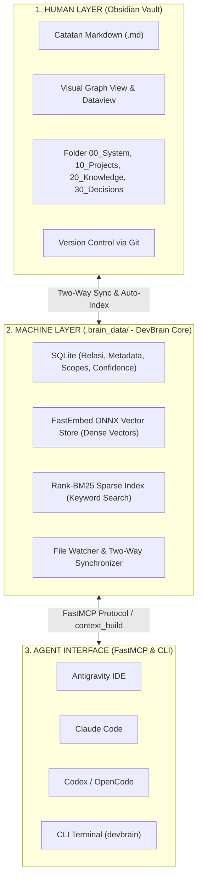

# 38. Peran SQLite, Arsitektur Dual-Layer & Rangkuman Evolusi Konsep DevBrain

| Metadata | Nilai |
| :--- | :--- |
| **Topik** | Penjelasan Fungsi SQLite, Arsitektur Dual-Layer (Human vs Machine), Perubahan Mindset & Penambahan Fitur Baru |
| **Status** | 💡 Brainstorming & Architectural Clarification |
| **Referensi** | [33.md](./33.md), [35.md](./35.md), [37-sintesis-arsitektur-central-ai-context-dan-memory-system.md](./37-sintesis-arsitektur-central-ai-context-dan-memory-system.md) |
| **Tanggal** | 2026-08-30 |

---

## 1. Untuk Apa SQLite di DevBrain? Mengapa Perlu Jika Sudah Ada Markdown Obsidian?

File Markdown (`.md`) di Obsidian sangat sempurna untuk **manusia**, tetapi memiliki keterbatasan teknis jika hanya mengandalkan file teks mentah untuk **AI multi-agent berkecepatan tinggi**:

```text
┌─────────────────────────────────────────────────────────────────────────┐
│                     MENGAPA KITA MENGGUNAKAN SQLITE?                    │
├────────────────────────────────┬────────────────────────────────────────┤
│ Keterbatasan File Markdown     │ Keunggulan SQLite (Machine Layer)      │
├────────────────────────────────┼────────────────────────────────────────┤
│ ❌ Lambat untuk query relasi   │ ⚡ Query instan (<0.5 ms):             │
│    kompleks (harus scan ribuan │    SELECT * FROM memories WHERE        │
│    file teks satu per satu).   │    scope='project' AND confidence > 0.8│
├────────────────────────────────┼────────────────────────────────────────┤
│ ❌ Rawan konflik / file lock   │ 🛡️ ACID Transactions:                 │
│    jika 3 agent menulis bareng.│    Mencegah korupsi data saat multi-   │
│                                │    agent aktif bersamaan.              │
├────────────────────────────────┼────────────────────────────────────────┤
│ ❌ Sulit melacak status memori │ 🧠 Status & Lifecycle Tracking:        │
│    yang usang (superseded).    │    Mudah menandai memori lama sebagai   │
│                                │    'superseded' saat ada memori baru.  │
├────────────────────────────────┼────────────────────────────────────────┤
│ ❌ Tidak efisien untuk cache   │ 📦 State & Hash Cache:                 │
│    vektor & chunk metadata.    │    Menyimpan mtime file & pointer ID   │
│                                │    vektor tanpa re-parse berulang.     │
└────────────────────────────────┴────────────────────────────────────────┘
```

> **Kesimpulan Peran SQLite:**
> * **SQLite BUKAN pengganti Obsidian Markdown.**
> * SQLite adalah **Embedded Machine Cache & Index Engine** lokal di `.brain_data/brain.db` (0 setup, 0 MB server overhead) yang bekerja di balik layar agar AI bisa mengakses memori dalam hitungan milidetik.
> * **Obsidian Markdown tetap menjadi Source of Truth (SSOT)** yang bisa Anda baca, edit, dan miliki selamanya tanpa vendor lock-in.

---

## 2. Bagaimana Konsep Kerjanya? (Arsitektur Dual-Layer)



### Mekanisme Sinkronisasi Dua Arah (*Two-Way Harmony*):
1. **Saat Anda Mengetik di Obsidian:** File watcher mendeteksi perubahan $\rightarrow$ mengupdate index SQLite & vektor FastEmbed secara otomatis.
2. **Saat AI Agent Mencatat Memori Baru:** DevBrain menulis file Markdown baru ke folder Obsidian (`90_Agent_Inbox/` atau `30_Decisions/`) $\rightarrow$ sekaligus mencatat metadata ke SQLite.

---

## 3. Apa yang BERUBAH dari Hasil Brainstorming?

### Perubahan Paradigma (Evolusi Pola Pikir):

| Paradigma Lama (Awal Proyek) | Paradigma Baru (Setelah Dokumen 33-37) |
| :--- | :--- |
| **"Obsidian Vault adalah seluruh AI Brain"** | **"DevBrain adalah Central Context & Memory Hub (PAIOS), sedangkan Obsidian adalah antarmuka visual pengetahuan manusia."** |
| AI membaca file Markdown mentah via search biasa. | AI menerima **Kartu Situasional Terpadu (`context_build`)** berisi kombinasi preferensi, projek, ADR, dan knowledge. |
| Semua data koding dicampur dalam satu tumpukan catatan. | Konteks dipisah menjadi **5 Domain Tegas** (*User, Project, Knowledge, Decision/ADR, Session*). |

---

## 4. Apa PENAMBAHAN Fitur Baru yang Direncanakan?

Berikut adalah 5 fitur baru bernilai tinggi hasil sintesis seluruh dokumen brainstorming:

### 🌟 1. Modul Architecture Decision Records (ADR Framework)
* **Tujuan:** Mencatat alasan mengapa suatu arsitektur dipilih (agar AI tidak bolak-balik mengubah keputusan lama).
* **Fitur:** Folder `30_Decisions/`, CLI `devbrain adr new "Judul"`, dan MCP tool `get_decisions(project)`.

### 🌟 2. Context Assembly Engine (`context_build` & `devbrain context`)
* **Tujuan:** Mengirimkan *situational awareness card* ke AI sebelum mulai koding.
* **Fitur:** Menggabungkan Stack + Git Branch aktif + ADR relevan + Preferensi User dalam 1 panggil.

### 🌟 3. User Preferences & Coding Persona Memory
* **Tujuan:** Mengingat preferensi user (bahasa koding favorit, gaya jawaban, aturan styling) lintas semua AI tools.
* **Fitur:** File `00_System/User_Preferences.md` & MCP tool `get_user_context()`.

### 🌟 4. Memory Scope & Lifecycle Management
* **Tujuan:** Mencegah memori menjadi sampah obrolan yang usang.
* **Fitur:** Tingkatan scope (`GLOBAL`, `PROJECT`, `TASK`, `SESSION`) serta deteksi konflik otomatis (*superseded old memories*).

### 🌟 5. Workspace Rules Auto-Generator (`devbrain rules init`)
* **Tujuan:** Men-generate file instruksi standar `AGENTS.md` dan `CLAUDE.md` di setiap repositori koding user.
* **Fitur:** Menyuntikkan aturan baku: *Code Behavior > Obsidian Vault > AGENTS.md > Chat History*.
