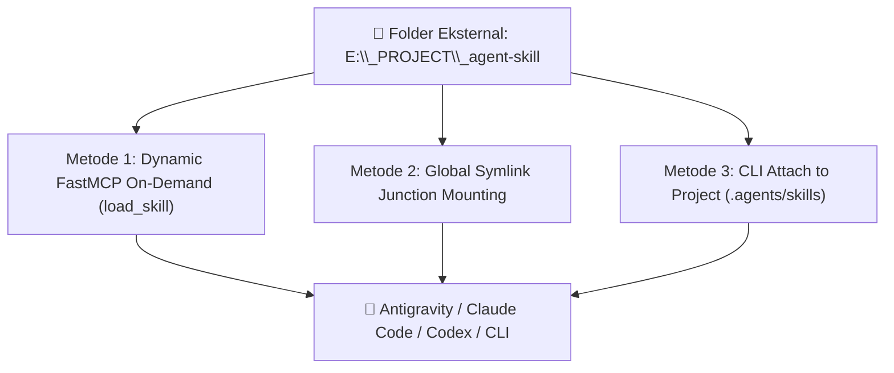

# 42. Sentralisasi Agent Skills: Akses Folder Eksternal & Manajemen Skill Baru

| Metadata | Nilai |
| :--- | :--- |
| **Topik** | Mekanisme AI Membaca Skill di Luar Workspace (`E:\_PROJECT\_agent-skill`), Integrasi FastMCP `load_skill`, Symlink Junction & Cara Menambahkan Skill Baru |
| **Status** | 💡 Brainstorming & Technical Guide |
| **Referensi** | [11-sentralisasi-agent-skills-dan-efisiensi-token.md](./11-sentralisasi-agent-skills-dan-efisiensi-token.md), [37-sintesis-arsitektur-central-ai-context-dan-memory-system.md](./37-sintesis-arsitektur-central-ai-context-dan-memory-system.md), [41-penjelasan-inti-arsitektur-hakikat-devbrain.md](./41-penjelasan-inti-arsitektur-hakikat-devbrain.md) |
| **Tanggal** | 2026-08-30 |

---

## 1. Pertanyaan 1: Apakah AI Bisa Membaca Skill di Luar Direktori Projek atau Luar Global Config? (Misal di `E:\_PROJECT\_agent-skill`)

> **BISA! DevBrain menyediakan 3 mekanisme agar AI di project mana pun bisa membaca skill eksternal:**



---

### 🚀 Metode 1: Lewat Protokol FastMCP (`load_skill`) — Paling Universal & Fleksibel
AI Agent tidak perlu memiliki folder skill fisik di dalam workspace kodingnya. Saat terhubung ke **DevBrain FastMCP Server**, AI memiliki akses ke MCP tool:
* `list_skills()`: Menampilkan semua skill yang terdaftar di Central Brain & folder eksternal.
* `load_skill(skill_name)`: Mengambil isi instruksi `SKILL.md` secara instan (*Just-In-Time*) ke dalam memori agent.

**Cara Konfigurasinya di `.brainrc.json`:**
```json
{
  "vault_path": "E:/_PROJECT/_Central AI Brain Hub",
  "custom_skill_roots": [
    "E:/_PROJECT/_agent-skill",
    "D:/My_Custom_Skills"
  ]
}
```
Ketika Antigravity IDE atau Claude Code sedang membuka projek apa pun (misal `E:\_PROJECT\_fxmedia`), AI cukup memanggil `load_skill("docker-deploy")` $\rightarrow$ DevBrain otomatis mengambilnya dari `E:\_PROJECT\_agent-skill`!

---

### 🔗 Metode 2: Melalui Directory Junction ke Global Config Antigravity
Secara bawaan (*native*), Antigravity IDE membaca skill global dari:
* Windows: `C:\Users\<User>\.gemini\config\skills\`

Dengan DevBrain, kita bisa membuat **Windows Directory Junction (0 MB copy)**:
```bash
# Perintah CLI DevBrain untuk me-link folder skill eksternal ke global config
devbrain skill link "E:/_PROJECT/_agent-skill" --global
```
Folder `_agent-skill` langsung terbaca otomatis sebagai skill bawaan di seluruh workspace Antigravity IDE Anda tanpa memakan kapasitas harddisk ganda.

---

### 📦 Metode 3: Attach ke Projek Tertentu (`devbrain skill attach`)
Jika Anda hanya ingin skill tertentu aktif di 1 projek koding spesifik:
```bash
devbrain skill attach "docker-deploy" --project "E:/_PROJECT/_fxmedia"
```
DevBrain membuat link junction ke `.agents/skills/docker-deploy/` di dalam project tersebut.

---

## 2. Pertanyaan 2: Bagaimana Cara Menambahkan Skill Baru ke Vault Utama?

Ada **3 cara mudah** untuk menambahkan skill baru ke dalam Central Brain:

---

### 🛠️ Cara A: Lewat Perintah CLI `devbrain skill add` (Paling Cepat)
Anda dapat membuat template skill baru langsung dari terminal:
```bash
# Membuat skill baru dengan struktur standar
devbrain skill add "nestjs-microservice" --description "Panduan arsitektur microservice NestJS & Kafka"
```

DevBrain otomatis men-generate struktur standar di `00_System/Agent_Skills/nestjs-microservice/SKILL.md`:
```markdown
---
name: nestjs-microservice
description: Panduan arsitektur microservice NestJS & Kafka
author: DycandX
version: 1.0.0
tags: [nestjs, microservice, kafka]
---

# NestJS Microservice Best Practices

## When to Use This Skill
Gunakan skill ini saat merancang atau me-refactor service NestJS dengan transport Kafka.

## Key Instructions & Rules
1. Gunakan Hybrid Application pattern.
2. Pisahkan DTO dan Interface contract.
3. Selalu sertakan schema validation class-validator.

## Code Examples
...
```

---

### ✍️ Cara B: Dibuat Otomatis oleh AI Agent (Melalui MCP Tool)
Saat Anda selesai melakukan alur kerja kompleks dengan Antigravity IDE atau Claude Code, Anda cukup berkata ke AI:
> *"Tolong simpan workflow yang baru saja kita lakukan ini menjadi skill baru bernama 'fastapi-jwt-auth'."*

AI Agent akan memanggil MCP tool:
```python
create_agent_skill(
    name="fastapi-jwt-auth",
    description="Implementasi autentikasi JWT FastAPI dengan token blacklist",
    instructions="..."
)
```
Skill baru langsung tersimpan rapi di Vault Obsidian Anda!

---

### 📂 Cara C: Dibuat Manual di Aplikasi Obsidian
Karena seluruh sistem DevBrain berbasis file Markdown terbuka:
1. Buka aplikasi **Obsidian**.
2. Masuk ke folder `00_System/Agent_Skills/`.
3. Buat folder baru (misal: `react-query-patterns/`) dan buat file `SKILL.md`.
4. DevBrain Watcher akan **langsung mengindeksnya dalam 0.1 detik** sehingga semua AI Agent bisa langsung menggunakannya.

---

## 3. Matriks Perbandingan Akses Skill

| Metode Akses | Apakah Butuh File di Project? | Mendukung Antigravity? | Mendukung Claude Code? | Mendukung CLI? |
| :--- | :--- | :--- | :--- | :--- |
| **FastMCP `load_skill()`** | ❌ Tidak (JIT Stream) | ✅ Ya | ✅ Ya | ✅ Ya |
| **Global Config Symlink** | ❌ Tidak (Global Link) | ✅ Ya | ✅ Ya | ✅ Ya |
| **Project `.agents/skills`** | ✅ Ya (Junction 0 MB) | ✅ Ya | ✅ Ya | ✅ Ya |

---

## 4. Kesimpulan

1. **Fleksibel & Terpusat:** AI Agent **bisa membaca skill dari mana saja**, termasuk folder eksternal seperti `E:\_PROJECT\_agent-skill`, cukup dengan mendaftarkan jalurnya ke DevBrain via `devbrain skill link` atau FastMCP `load_skill`.
2. **Mudah Dikelola:** Menambahkan skill baru bisa dilakukan lewat **CLI (`devbrain skill add`)**, **Perintah AI di chat**, atau **Tulis langsung di Obsidian**.
