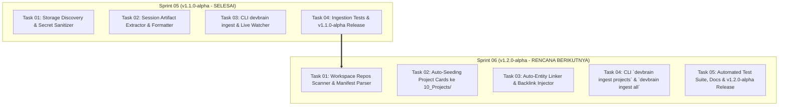

# Implementation Plan - Level 1 Extend (v1.1 - v1.2): Graph Mesh & Workspace Project Harvester

| Attribute | Detail |
| :--- | :--- |
| **Project** | `devbrain` (Central AI Second Brain Hub) |
| **Tier** | **Level 1 Extension (v1.1 - v1.2)** |
| **Derived From** | [Brainstorming 24](../../brainstorming/24-lokasi-storage-harvester-dan-katalog-data-ingesti.md), [Brainstorming 25](../../brainstorming/25-posisi-arsitektur-ingest-dan-nomenklatur-command.md), [Brainstorming 26](../../brainstorming/26-otomatisasi-koneksi-graph-wikilinks-dan-entitas.md), [Brainstorming 27](../../brainstorming/27-workspace-project-harvester-dan-auto-seeding.md) |
| **Tech Stack** | Python 3.10+ (Typer, Rich, FastEmbed, BM25, Watchdog, Pydantic, Regex) |
| **Status** | 🚀 Ready for Execution (Sprint 05 Completed, Sprint 06 Planned) |

---

## 1. Latar Belakang & Tujuan Ekstensi Level 1

Pada rilis inti Level 1 (`v1.0.0-alpha`), `devbrain` berhasil menyediakan memori lokal zero-friction, hybrid search BM25+FastEmbed, dan gateway FastMCP. 

Ekstensi **Level 1.1 - 1.2** bertujuan untuk menyelesaikan **dua tantangan mendasar** dalam manajemen pengetahuan berbasis Obsidian:
1. **Eliminasi *Orphan Nodes* (Dense Graph Mesh):** Menghubungkan secara otomatis catatan sesi AI di `90_Agent_Inbox/` ke dokumen induk projek di `10_Projects/`, catatan harian di `99_Daily/`, dan referensi teknologi di `20_Knowledge/` menggunakan sintaks `[[Wikilinks]]`.
2. **Workspace Project Harvester (`devbrain ingest projects`):** Memindai seluruh repositori Git dan codebase fisik di komputer pengguna, membaca file manifest (`pyproject.toml`, `package.json`, `Cargo.toml`, `go.mod`), dan meng-auto-seed kartu ringkasan projek ke `10_Projects/<Project_Name>/README.md`.

---

## 2. Arsitektur Komponen Teknis Tambahan

```
src/devbrain/
├── core/
│   ├── config.py                 # Ditambahkan: workspace_roots: List[str]
│   └── scaffolder.py             # Ditambahkan: Dataview queries di Inbox & Projects Index
├── harvester/
│   ├── discovery.py              # [Selesai] Multi-Agent Session Discovery (IDE, CLI, Claude, Cline)
│   ├── sanitizer.py              # [Selesai] Regex Secret Redactor (OpenAI, Anthropic, Google, GitHub, etc.)
│   ├── extractor.py              # [Selesai] Clean Prompt & Artifact Payload Extractor
│   ├── formatter.py              # [Selesai] Obsidian Safe YAML Frontmatter Formatter
│   ├── service.py                # [Selesai] Ingestion Orchestrator & Deduplication Registry
│   ├── manifest_parser.py        # [NEW Sprint 06] Parser pyproject.toml, package.json, Cargo.toml, go.mod
│   ├── project_harvester.py      # [NEW Sprint 06] Git Repo Scanner & Metadata Aggregator
│   └── entity_linker.py          # [NEW Sprint 06] Auto-Wikilink Graph Connector & Backlink Injector
└── cli/
    └── commands/
        └── ingest_cmd.py         # [Updated Sprint 06] Dukungan `ingest`, `ingest projects`, & `ingest all`
```

---

## 3. Pembagian Sprint Level 1 Extension



---

## 4. Rincian Sprint 06: Auto-Entity Linker & Workspace Project Harvester

### 📄 Task 01: Workspace Repos Scanner & Manifest Parser
* **Target File:** `src/devbrain/harvester/manifest_parser.py`, `src/devbrain/harvester/project_harvester.py`
* **Deskripsi:**
  * Memindai direktori `workspace_roots` untuk mendeteksi repositori Git (`.git/`).
  * Mengekstrak Remote URL, active branch, dan author.
  * Mengurai manifest dependensi:
    * Python (`pyproject.toml`, `requirements.txt`, `Pipfile`)
    * Node/TypeScript (`package.json`, `tsconfig.json`)
    * Rust (`Cargo.toml`) & Go (`go.mod`)
    * DevOps (`Dockerfile`, `docker-compose.yml`)

### 📄 Task 02: Auto-Seeding Project Cards ke `10_Projects/`
* **Target File:** `src/devbrain/harvester/project_harvester.py`, `src/devbrain/core/scaffolder.py`
* **Deskripsi:**
  * Menulis kartu projek standar di `10_Projects/<Nama_Projek>/README.md`.
  * Menyertakan Frontmatter YAML terstandarisasi (`id`, `title`, `type: project`, `language`, `stack`, `git_remote`, `local_path`, `tags`).
  * Menyisipkan blok query **Obsidian Dataview** untuk merender daftar sesi AI terkini yang terkait secara otomatis.

### 📄 Task 03: Auto-Entity Linker Engine & Backlink Injector
* **Target File:** `src/devbrain/harvester/entity_linker.py`
* **Deskripsi:**
  * **Path Matcher:** Menghubungkan sesi AI ke kartu projek induk berdasarkan `workspace_path`.
  * **Daily Matcher:** Menghubungkan sesi ke catatan harian `[[99_Daily/YYYY-MM-DD]]`.
  * **Tech Entity Matcher:** Mengenali kata kunci teknologi yang ada di vault dan menyisipkan `[[Wikilinks]]`.
  * **Backlink Injection:** Menambahkan riwayat sesi terbaru ke dalam file README projek terkait.

### 📄 Task 04: Unified CLI Commands (`projects` & `all`)
* **Target File:** `src/devbrain/cli/commands/ingest_cmd.py`, `src/devbrain/cli/main.py`
* **Deskripsi:**
  * `devbrain ingest projects [--dir <path>] [--dry-run]`: Memindai dan meng-ingest katalog repositori.
  * `devbrain ingest all`: Full scan (ingest repo + ingest sesi AI + link seluruh graf).
  * Auto-provisioning: `devbrain ingest` sesi AI otomatis membuatkan kartu projek jika projeknya belum terdaftar di vault.

### 📄 Task 05: Automated Test Suite & Release `v1.2.0-alpha`
* **Target File:** `tests/test_project_ingestion.py`, `tests/test_entity_linker.py`, `CHANGELOG.md`, `docs/changelog/v1.2.0-alpha.md`
* **Deskripsi:**
  * Unit dan integration tests untuk manifest parsing, project card creation, dan auto-wikilink generation.
  * Memastikan seluruh test suite (35+ tests) lulus 100%.
  * Pembaruan CHANGELOG dan rilis `v1.2.0-alpha`.

---

## 5. Matriks Hasil yang Diharapkan (*Expected Outcome*)

1. **Obsidian Graph View yang Padat & Terhubung:** Tidak ada lagi *orphan nodes*. Setiap sesi terhubung dengan projek, tanggal, dan teknologinya.
2. **Katalog Proyek Terpusat:** Seluruh repo koding di laptop otomatis terdaftar di Obsidian tanpa perlu input manual.
3. **Konteks Instan untuk AI Agent:** Tool MCP `get_project_context` langsung membaca kartu projek yang kaya informasi arsitektur dan dependensi.
