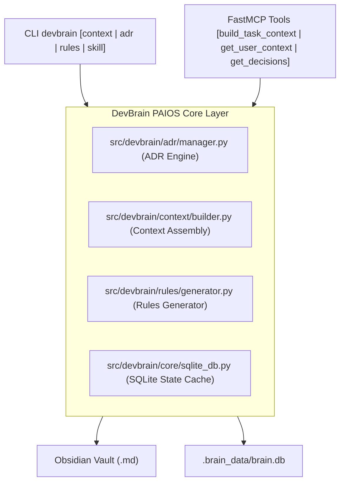

# Implementation Plan 05 - Personal AI Context & Memory Operating Hub (PAIOS Layer)

| Metadata | Nilai |
| :--- | :--- |
| **Feature** | PAIOS Context Assembly Engine, ADR Framework, User Preferences, Workspace Rules & SQLite State Cache |
| **Release Target** | `v1.6.0-alpha` (Sprint 10) |
| **Dokumen Brainstorming** | [33.md](../../brainstorming/33.md) s/d [44-rangkuman-komprehensif-evolusi-dan-spesifikasi-fitur-baru.md](../../brainstorming/44-rangkuman-komprehensif-evolusi-dan-spesifikasi-fitur-baru.md) |
| **Status** | 📋 Implementation Plan Ready (Menunggu Instruksi User untuk Eksekusi) |

---

## 1. User Review Required

> [!IMPORTANT]
> **Pemberitahuan Arsitektur:**
> Sesuai instruksi Anda, rencana implementasi ini dirancang secara lengkap dan terstruktur, **tetapi tidak akan dieksekusi sebelum Anda memberikan konfirmasi/persetujuan eksplisit**.

---

## 2. Overview & Problem Statement

Hingga `v1.5.0-alpha`, DevBrain memiliki Hybrid Search, FastMCP Gateway, Multi-Agent Harvester, dan Multi-Vault Federation. Namun:
1. **Keputusan Arsitektur (ADR)** belum memiliki modul khusus sehingga AI kerap mengubah keputusan koding yang sudah disepakati sebelumnya.
2. **Konteks Tugas AI** masih bergantung pada pencarian kata kunci/vektor mentah (*RAG pasif*), belum memiliki **Context Assembly Engine (`context_build`)** yang secara cerdas merakit preferensi pengguna, status branch git, ADR, dan ringkasan diff sesi koding terakhir.
3. **Aturan Repositori Koding (`AGENTS.md` / `CLAUDE.md`)** belum di-generate secara otomatis dengan aturan *Hierarchy of Truth* yang baku.
4. **Machine Layer** membutuhkan SQLite lokal di `.brain_data/brain.db` untuk melacak status memori usang (*superseded conflicts*), scope (`GLOBAL`, `PROJECT`, `TASK`, `SESSION`), dan query relasi instan (<0.5 ms).

---

## 3. Proposed Architecture & Component Breakdown



---

## 4. Proposed File Changes & Task Specifications

### [Component 1: SQLite Machine State & Relational Cache]
#### [NEW] `src/devbrain/core/sqlite_db.py`
* Mengimplementasikan `BrainSQLiteStorage` di `.brain_data/brain.db`.
* Skema tabel:
  * `memories` (id, type, content, scope, confidence, source, status, created_at, superseded_by).
  * `decisions` (id, title, project, status, file_path, date).
  * `file_cache` (file_path, mtime, sha256_hash, chunk_count).
* Fungsi: `upsert_memory()`, `get_active_memories()`, `supersede_memory()`, `upsert_decision()`, `get_decisions()`.

---

### [Component 2: Architecture Decision Records (ADR Framework)]
#### [NEW] `src/devbrain/adr/manager.py`
* Mengimplementasikan `ADRManager` untuk mengelola folder `30_Decisions/`.
* Fungsi:
  * `create_decision(title, project, context, decision, consequences, status="accepted")` $\rightarrow$ auto-generate `ADR-XXX-<slug>.md` dengan YAML frontmatter standar.
  * `list_decisions(project=None, status="accepted")` $\rightarrow$ membaca dan memfilter keputusan arsitektur.
  * `link_decision_to_project(adr_id, project_name)` $\rightarrow$ menyuntikkan `[[ADR-XXX]]` ke catatan `10_Projects/<project>/README.md`.

---

### [Component 3: Context Assembly Engine (`context_build`)]
#### [NEW] `src/devbrain/context/builder.py`
* Mengimplementasikan `ContextAssemblyEngine`.
* Fungsi `build_task_context(task: str, project: str) -> TaskContextCard`:
  1. Mengambil **User Preferences** dari `00_System/User_Preferences.md`.
  2. Mengambil **Project Metadata** (Stack, entrypoints, active branch) dari `10_Projects/<Project>/README.md`.
  3. Mengambil **Active ADRs** dari `ADRManager.list_decisions(project)`.
  4. Menjalankan **Hybrid Search** untuk mengambil cuplikan knowledge yang relevan dengan `task`.
  5. Mengambil **Recent Work Summary** dari sesi terakhir di `90_Agent_Inbox/`.
  6. Mengemas output menjadi format Markdown / JSON yang ringkas dan padat untuk disuntikkan ke AI Agent.

---

### [Component 4: Workspace Rules & Hierarchy of Truth Generator]
#### [NEW] `src/devbrain/rules/generator.py`
* Mengimplementasikan `RulesGenerator`.
* Fungsi `generate_project_rules(project_dir: Path, vault_path: Path)`:
  * Men-generate `AGENTS.md` dan `CLAUDE.md` di root folder koding target.
  * Menyuntikkan aturan **Hierarchy of Truth**:
    ```markdown
    # Hierarchy of Truth
    1. Current Working Code (Actual Behavior)
    2. Obsidian Central Brain & ADRs (Documented Truth)
    3. AGENTS.md / CLAUDE.md (Operational Rules)
    4. AI Conversation History (Temporary Context)
    ```

---

### [Component 5: FastMCP Protocol Gateway Expansion]
#### [MODIFY] `src/devbrain/mcp_server/server.py`
* Menambahkan 4 tools FastMCP baru:
  * `build_task_context(task: str, project: str) -> str`: Merakit kartu situasional cerdas untuk agent.
  * `get_user_context() -> str`: Mengambil preferensi pengguna dan styling rules.
  * `get_decisions(project: str) -> list[dict]`: Mengambil daftar keputusan arsitektur aktif.
  * `record_decision(project: str, title: str, context: str, decision: str, consequences: str) -> str`: Menulis ADR baru langsung dari chat AI.

---

### [Component 6: CLI Sub-Apps Expansion]
#### [NEW] `src/devbrain/cli/commands/adr_cmd.py`
* Menambahkan perintah `devbrain adr new "<title>" --project "<proj>"` dan `devbrain adr list`.
#### [NEW] `src/devbrain/cli/commands/context_cmd.py`
* Menambahkan perintah `devbrain context <project> [--task "<task>"]`.
#### [NEW] `src/devbrain/cli/commands/rules_cmd.py`
* Menambahkan perintah `devbrain rules init [PROJECT_DIR]`.
#### [MODIFY] `src/devbrain/cli/commands/skill_cmd.py` & `src/devbrain/cli/main.py`
* Menambahkan sub-perintah `devbrain skill link` dan `devbrain skill attach`.
* Mendaftarkan sub-app `adr_app`, `context_app`, dan `rules_app`.

---

### [Component 7: Automated Test Suite]
#### [NEW] `tests/test_paios_engine.py`
* Test unit & integrasi untuk:
  * `test_sqlite_storage_and_scopes()`
  * `test_adr_lifecycle_and_creation()`
  * `test_context_assembly_engine()`
  * `test_rules_generator()`
  * `test_fastmcp_new_tools()`
  * `test_cli_adr_and_context()`

---

## 5. Verification Plan

### Automated Tests:
```bash
python -m pytest -v tests/
```
Target: 100% passing tests mencakup seluruh modul baru dan modul eksisting.

### Manual Verification Scenarios:
1. Jalankan `python -m devbrain.cli.main adr new "Gunakan SQLite Cache" --project "CentralBrain" --vault "demo_vault"`.
2. Jalankan `python -m devbrain.cli.main context CentralBrain --task "optimasi performa query" --vault "demo_vault"` dan verifikasi kartu briefing yang dihasilkan.
3. Jalankan `python -m devbrain.cli.main rules init "E:/_PROJECT/_TEST/HowToBeAProgrammer"` dan verifikasi isi `AGENTS.md` & `CLAUDE.md`.
4. Uji pemanggilan FastMCP tools `build_task_context()` dan `get_decisions()`.

---

## 6. Status Eksekusi

> [!NOTE]
> **Status Saat Ini:** **STANDBY / MENUNGGU PERSETUJUAN USER**.
> Tidak ada kode yang akan diubah sebelum Anda memberikan perintah untuk memulai sprint ini.
