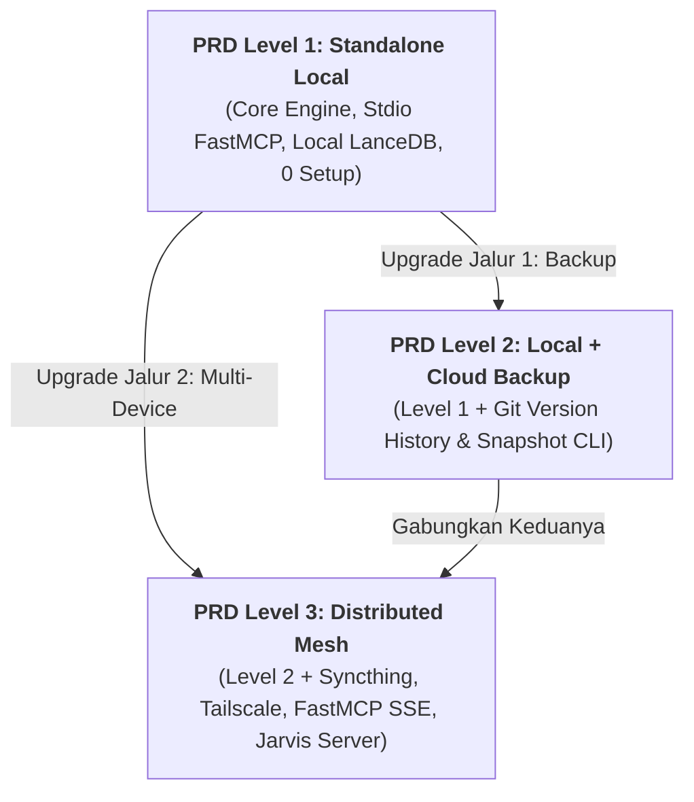

# 📑 Product Requirements Documents (PRD) - Central AI Brain Hub

Folder ini memuat dokumen spesifikasi kebutuhan produk (*Product Requirements Documents*) resmi untuk proyek **Central AI Brain Hub (`devbrain`)**, yang disusun berdasarkan filosofi **3 Level Adopsi Gradual**.

---

## 📂 Daftar Dokumen PRD

| Dokumen PRD | Target Profil Pengguna | Arsitektur & Lingkup |
| :--- | :--- | :--- |
| 📄 [01: PRD Level 1 - Standalone Local](./01-prd-level-1-standalone-local.md) | Single Developer / 1 Laptop Pribadi | **Zero-Friction Core:** 100% Offline, FastMCP Stdio, In-Process LanceDB/FastEmbed, Typer CLI `devbrain init`, Auto-scaffold Vault, Zero-Docker, Zero-Sync. |
| 📄 [02: PRD Level 2 - Local + Cloud Backup](./02-prd-level-2-local-cloud-backup.md) | Developer yang butuh Disaster Recovery & Versioning | **Local + Safety Net:** Core Level 1 + Git Auto-Sync ke Private GitHub/GitLab, Snapshot Backup CLI `devbrain backup`, Time-Machine Version Revert. |
| 📄 [03: PRD Level 3 - Distributed Multi-Device Mesh](./03-prd-level-3-multi-device-mesh.md) | Power User dengan Multi-Laptop & Homeserver | **Distributed 24/7 Mesh:** Central Homeserver (Jarvis), FastMCP SSE Gateway (Port 8000), Qdrant Vector DB, Syncthing over Tailscale, Web UI Dashboard. |

---

## 🎯 Hubungan Antar Level PRD

